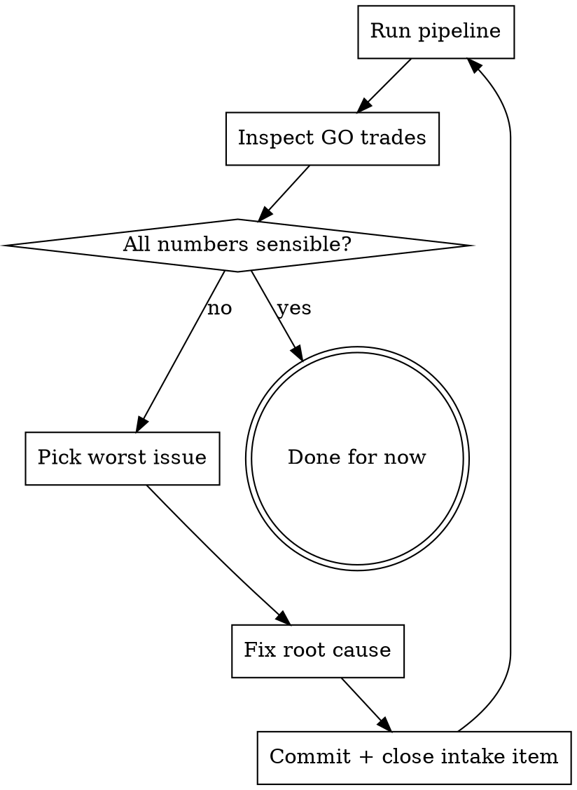

# Pipeline Verification

Run the actual trading pipeline with simulated data. Look at the output. Fix what's wrong. Repeat.

**This replaces running pytest.** Unit tests don't catch pipeline integration bugs. The pipeline output is what matters.

## Integration with Project Management

This skill is NOT standalone. It's part of the daily workflow:

1. **`project-management` skill** — read MEMORY.md, run project_status.py, know the state
2. **`pipeline-verification` skill** (this) — run simulated pipeline, find issues, fix with plan
3. **`live-trading-test` skill** — when market opens, verify with real broker data

**Fixes found here feed back into intake docs** — every fix closes an existing item or creates a new one with a plan. No ad-hoc patches. Every change is traceable to an objective.

**Before fixing anything found here:**
- Check if it's already an intake item (don't duplicate)
- If it's a new issue, log it in the appropriate intake doc FIRST
- If the fix touches >2 files, write a brief design (in conversation or plan doc)
- Get user alignment on approach before coding

**Multiple independent fixes → use `superpowers:dispatching-parallel-agents`:**
- After verification identifies 3+ independent issues, batch them
- Each subagent gets: the issue, the file(s) to change, the expected outcome
- Main thread runs pipeline verification after all subagents complete
- One final commit with all fixes, one pipeline run to confirm

## When to Run

- Session start (after reading memory, before any work)
- After ANY change to: assessors, pricing, POP, validator, ranking, trade_spec_helpers
- Before claiming a fix works
- Before committing pipeline-related changes

## The Flow



## Step 1: Run Both Markets

```python
PYTHONIOENCODING=utf-8 .venv_312/Scripts/python -c "
from income_desk.adapters.simulated import create_ideal_income, create_india_trading, SimulatedMetrics
from income_desk import MarketAnalyzer, DataService
from income_desk.workflow.rank_opportunities import RankRequest, rank_opportunities

for market, sim_fn, capital in [('US', create_ideal_income, 50_000), ('India', create_india_trading, 5_000_000)]:
    sim = sim_fn()
    mm = SimulatedMetrics(sim)
    ma = MarketAnalyzer(data_service=DataService(), market_data=sim, market_metrics=mm)
    tickers = sim.supported_tickers()
    metrics = mm.get_metrics(tickers)
    req = RankRequest(tickers=tickers, capital=float(capital), market=market,
                      iv_rank_map={t: m.iv_rank for t, m in metrics.items() if m.iv_rank},
                      iv_30_day_map={t: m.iv_30_day for t, m in metrics.items() if m.iv_30_day})
    resp = rank_opportunities(req, ma)
    has_pop = sum(1 for t in resp.trades if t.pop_pct and t.pop_pct > 0)
    has_credit = sum(1 for t in resp.trades if t.entry_credit and t.entry_credit != 0)
    reasonable = sum(1 for t in resp.trades if t.pop_pct and 0.05 < t.pop_pct < 0.95)
    print(f'{market:6s} | {len(tickers):2d} tickers | GO: {len(resp.trades):2d} | POP: {has_pop}/{len(resp.trades)} | Credit: {has_credit}/{len(resp.trades)} | Reasonable POP: {reasonable}/{len(resp.trades)} | Blocked: {len(resp.blocked)}')
"
```

## Step 2: Inspect — What to Look For

| Check | Healthy | Broken |
|-------|---------|--------|
| GO trades | 8-15 per market | 0-3 or >20 |
| POP coverage | 90-100% of GO | <80% (N/A trades) |
| Credit coverage | 80-100% of GO | <50% (N/A trades) |
| Reasonable POP | All between 5-95% | 0% or 100% trades |
| Zero-wing rejections | 0 | Any |
| Negative max_loss | 0-2 (simulated edge cases) | >5 |
| Crashes | 0 | Any traceback |

## Step 3: Drill Into GO Trades

```python
for t in resp.trades[:12]:
    pop_str = f'{t.pop_pct:.0%}' if t.pop_pct else 'N/A'
    cr_str = f'${t.entry_credit:.2f}' if t.entry_credit and t.entry_credit != 0 else 'N/A'
    print(f'  #{t.rank:2d} {t.ticker:6s} {t.structure:18s} credit={cr_str:>8s}  POP={pop_str:>5s}  lot={t.lot_size}')
```

**Red flags in GO trades:**
- POP = 0% or 100% (calculation bug)
- Credit = $0.00 (repricing failed silently)
- Credit = N/A for credit structures (chain lookup failed)
- Lot size = 100 for India stocks (should be per-instrument)
- Same ticker+structure appearing twice (dedup failure)

## Step 4: Manual POP Verification (One Trade)

Pick one credit trade. Compute POP by hand. Compare to pipeline output.

```python
import math
# From the GO trade output:
price, iv, dte, credit = 580.0, 0.18, 35, 3.50
short_put, short_call = 560.0, 600.0  # from trade output

be_low = short_put - credit
be_high = short_call + credit
expected_move = price * iv * math.sqrt(dte / 365)

dist_low = (price - be_low) / expected_move
dist_high = (be_high - price) / expected_move
pop_low = 0.5 * (1 + math.erf(dist_low / math.sqrt(2)))
pop_high = 0.5 * (1 + math.erf(dist_high / math.sqrt(2)))
pop = pop_low + pop_high - 1.0

print(f'Manual POP: {pop:.1%}')
print(f'Pipeline POP: {pipeline_pop:.1%}')
print(f'Match: {"YES" if abs(pop - pipeline_pop) < 0.05 else "INVESTIGATE"}')
```

## Step 5: Fix Systematically

**Triage order — fix worst first:**
1. Crashes/tracebacks (pipeline doesn't run)
2. POP = 0% or N/A (core calculation broken)
3. Credit = N/A or $0 (repricing broken)
4. Unreasonable POP (100%, <5%)
5. Zero-wing rejections (strike selection)
6. Negative max_loss (credit > wing width)

**For each fix — plan before coding:**
1. Trace the root cause — don't patch the symptom
2. **Write a brief plan** (in the conversation, not a doc): what's broken, why, what to change, which files
3. Get user approval if the fix touches >2 files or changes architecture
4. Fix the code
5. Run pipeline again — verify fix AND no regressions
4. `git commit` with clear message naming the root cause
5. Update repo intake doc — change status to CLOSED with commit hash
6. Run `python scripts/project_status.py | head -18` — convergence must improve

**Evidence required:** Every fix must show before/after pipeline output. "I fixed it" without re-running is not evidence.

## Circuit Breaker — Prevent Going in Circles

**Max 3 fix-and-run cycles per issue.** If the same problem persists after 3 attempts:
1. STOP trying to fix it
2. Log it as a new intake item with what you tried
3. Move to the next issue
4. Tell the user: "Stuck on X after 3 attempts — logged as [intake key], moving on"

**Max 10 total fix cycles per session.** After 10 fixes:
1. Run final verification
2. Report: "Fixed N issues, M remaining, convergence X%→Y%"
3. Ask user before continuing

**Signs you're going in circles:**
- Same "Rejected" message appearing after your fix
- Fixing one thing breaks another (regression)
- Fix requires changing >3 files (probably wrong approach — step back)

## What NOT to Do

- Do NOT run `pytest` and claim success
- Do NOT skip the pipeline run "because tests pass"
- Do NOT stop after one market — run BOTH US and India
- Do NOT ignore "Rejected" warnings in stderr — each one is a trade that should work but doesn't
- Do NOT claim "needs live broker" for issues that SimulatedMarketData can catch
- Do NOT open new intake items without closing existing ones first

## Baseline (April 1, 2026 — Before Fixes)

| Metric | Before | After |
|--------|--------|-------|
| GO trades with POP | 3/10 | 10/10 |
| GO trades with credit | 1/10 | 9/10 |
| Zero-wing rejections | 20+ | 0 |
| Strangle POP | 0% | 53-70% |
| Convergence | 0% (0 closed) | 29% (14 closed) |

This is the bar. If the numbers regress, something broke.
